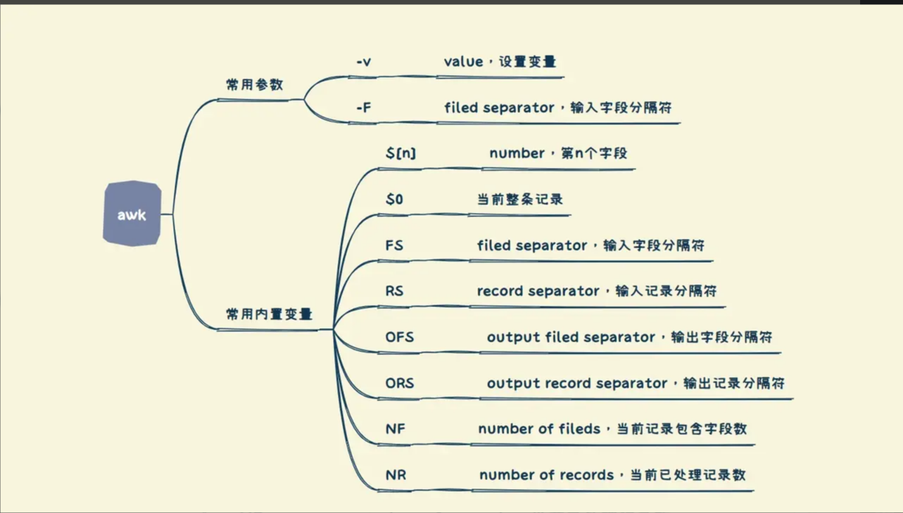
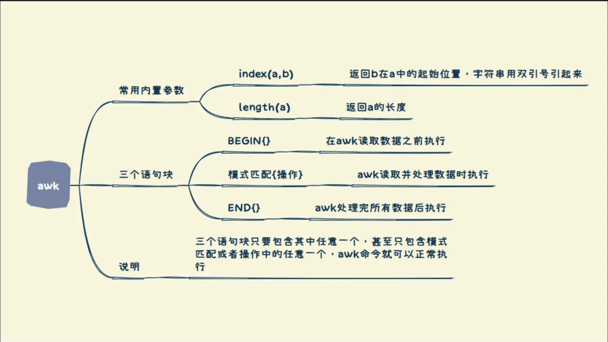

# <center>OS : lab0课下基础</center>

## 1. Linux Command

* ```cat```命令用于拼接文件并输出到标准输出，也可以用于查看单个文件内容。

  * 拼接文件并输出到标准输出，```cat file1 file2```将文件2的内容拼接到文件1的后边输出到标准输出

  * 查看单个文件内容，```cat file```

  * **常用：使用cat命令拼接文件重定向输出到文件中**

    ```
    cat file1 file2 > newfile
    ```

* ```head```查看文件的首部内容

  * ```head -n <n>```显示文件的前```n```行内容

* ```tail```查看文件的尾部内容

  * ```tail -n <n>```显示文件的后```n```行内容
  * ```tail -f <n>```文件增长时，输出后续添加的数据

* ```ps```命令用于显示当前进程状态（process status）

  * ```ps -e```显示所有进程
  * ```ps -f ```显示全部信息

* ```kill```用于向进程发送信号，不止于终止进程

  * ```kill -9```强制杀死进程

* ```sudo```超级用户权限执行命令

  * ```sudo command```

* ```mkdir```递归建立目录：```-p```参数

  * ```mkdir -p dir/inner```

## 2.有关文本处理

### 1. vim

* ```/<word>```文件下寻找名为```<word>```的字符串
* ```:%s/<word1>/<word2>/g```，全文中寻找```<word1>```字符串，并将该字符串取代为```<word2>```

* ```[n] yy```，复制游标所在的一行或n行，用p/P可以粘贴
* ```[n] dd```，删除游标所在的一行或n行，用p/P可以粘贴（类似于剪切）
* p粘贴在光标下一行，P粘贴在光标上一行
* u:undo
* ```ctrl + Q```块选，通过移动光标可以选中块，实现更加便捷的操作，例如删去段首的注释，为段首增加空格等。
  * ```d```剪切选中文本
  * ```y```复制选中文本
  * ```p```粘贴选中文本
  * ```u```复原
  * ```}```选中光标下一个段落
  * ```{```选中光标上一个段落

### 2. grep

> grep(global regular expression)命令用于查找文件中符合条件的字符串或正则表达式。**主要用于查找**

```
grep [options] pattern [files]
```

* ```pattern```表示要查找的字符串或正则表达式

* ```files```要查找的一个或多个文件或目录，若省略该参数则表示从标准输入中读取

* ```options```

  * ```-i```，忽略大小写进行匹配

  * ```-v```，反向查找，只打印不匹配的行

  * ```-n```，显示匹配行的行号

    > 需要注意的是 -n选项输出形式为 “行号:内容“ 而不只是行号

  * ```-r```，递归查找子目录中的文件

  * ```-l```，只打印匹配的文件名

  * ```-c```，只打印匹配的行数

  * ```-a```，不忽略二进制数据进行查找

### 3. sed

> sed可以通过命令编辑和输出文本，**通常用于整行的处理**

```
sed [选项] '命令' 输入文本
```

* 选项

  * ```-n```：安静模式，只显示经过sed处理的内容，否则显示输入文本的全部内容
  * ```-i```：直接修改读取的文件内容，而不是输出到屏幕

* 命令（用单引号括起来）

  * 关于命令中指定行数进行操作

    * 指定某一行，例如 ```'3p'```
    * 指定范围内的行，例如```'3,6p'```
    * 指定某几行，例如```'8p;32p;256p;1024p'```，用分号分隔
    * 最后一行用```$```表示
    * 不指定行则默认为所有行执行操作

  * <行号>a<内容> ： 在相应行下一行新增内容

  * <行号>i<内容>：在相应行上一行新增内容

  * <行号>c<内容> ：取代，用内容取代相应行的文本

  * <行号>d：删除相应行

  * <行号>p：输出相应行

  * <行号>s/<原字符串>/<替换字符串>/g：若有g则表示将对应行中所有原字符串替换，否则将只替换第一个原字符串，通常使用

    ```
    sed -i 's/str1/str2/g' text
    ```

    对文本进行全局替换

### 4. awk

> awk主要用于格式化处理文本，**倾向于将一行分为多个字段进行处理**

```
awk [options] '模式或条件 {操作}' files
awk -f 脚本文件 files
```

* **awk常用的内置变量**

  * **FS(field separator)：列分隔符，**指定每行文本的字段分隔符，默认为空格或制表位，与-F作用相同
  * **OFS:输出分隔符**，指定输出字段间的分隔符
  * **RS(record separator)：行分隔符**，awk处理文本时，每一行称为一个record，RS即为每行之间的分隔符
  * **NF：当前处理行的字段个数/被分割成的段数**
  * **NR(number of record)：当前处理行的行号**
  * **FNR(file number of record)：awk当前读取的记录数，其变量值小于等于NR**，当读取第二个文件时，FNR从0开始重新计数，NR不会。**故可以通过FNR==NR判断是不是在读取第一个文件**
  * **FILENAME：被处理的文件名**
  * **$0：当前处理行的整行内容**
  * **$n：当前处理行的第n个字段**

  

  ​	```(本图和下图来自B站Ternurafl)```

* 选项：

  * ```-F```：指定输入文件分隔符，```-F fs```

    > fs : field seperater 指每一行(每一个record)的分隔符

    例如课下作业中将grep查找的内容利用管道输入到awk,再利用awk将内容以```:```分隔开，

    ```
    grep -n "all" text | awk -F: 'print {$1}' > line.txt
    ```

    默认以空格或```<tab>```作为分隔符。文本中的每一行我们称作一个```record```，会对每个```record```用分隔符进行分割，例如文本示例如下

    ```
    welcome to BUAA cs
    ```

    以默认空格进行划分，会产生四个参数，分别记作```$1...$4```，**最后一个参数使用 $NF表示，倒数第二个参数 $(NF-1)** ，```$0```表示没有进行分割的整行的数据。

  * ```-v```对内置变量进行赋值，常见的是对FS,OFS等赋值

    * ```
      awk -v FS=':' '{print $1}'
      ```

    * ```
      awk -v OFS='#' '{print $1,$3}'
      ```

* 脚本

  > 脚本的格式 ：‘{ action }’

  * 例如lab0课下中 '{print $1}' 打印第一个参数，使用print会换行，使用printf进行打印需要有格式符，类似于C语言，支持指定格式输出例如以上例子

    ```
    '{printf "%-7s %-2s %-4s %-2s\n",$1,$2,$3,$4}'
    ```

    * 注：数字代表占最小宽，-代表左对齐

  * 对于'{action}'的形式只适用于一些比较简单的脚本操作，如果涉及到比较复杂的操作可以编写好脚本文件再使用```-f```参数读入。

    ```
    awk -f shell.sh files
    ```

* 常用的awk命令示例

  > 输出所有内容

  ```
  awk '{print $0}' a.txt   ## print 命令默认换行
  ```

  > 输出范围指定行号的内容 例如输出第一行到第三行的内容 通过逻辑与 && 实现 这同样可以通过sed实现

  ```
  awk 'NR==1,NR==3{print $0}' file
  awk '(NR>=1)&&(NR<=3){print $0}' file
  ```

  ```
  sed -n '1,3p' file
  ```

  * 这里使用了内置变量NR(number of record)
  * **awk命令中支持简单的逻辑操作和数学运算**
    * 逻辑操作 ：```&&, ||, ！```
    * 算术操作 ：```+ - * / % ^```

  > 输出离散行号的内容 通过逻辑或||实现  同样可以通过sed实现

  ```
  awk 'NR==1||NR==3{print $0}' file
  ```

  ```
  sed -n '1p;3p' file
  ```

  > 输出奇偶行内容

  ```
  awk 'NR%2==1{print $0}' file 
  ```

  ```
  awk 'NR%2==0{print $0}' file
  ```

  > 输出匹配行的内容 字符串、以什么开头结尾、正则表达式等 用 /.../形式
  >
  > * ^表示以什么开头 例如 ^e表示以e开头
  > * $表示以什么结尾 例如 r$表示以r结尾

  ```
  awk '/^d/{print $0}' file ##输出以d开头
  awk '/r$/{print $0}' file ##输出以r结尾
  awk '/dqr/{print $0}' file ## 输出匹配字符串dqr的行
  awk '/pattern/{print $0}' file ## 输出正则表达式匹配的行
  ```

  > 指定fs进行分割

  ```
  awk -F : '{print $1}' file ## 输出以冒号作为field separator分割的第一项
  ```

  > 指定分隔符进行输出 只要在输出项之间加上分隔符输出

  ```
  awk '{print $1" is not equal to "$3}'
  awk '{print $1"=="$3}'
  ```

  > 指定分隔符输出还可以通过对OFS变量进行赋值
  >
  > * 可以在'{actioin}'外边通过-v参数对变量进行赋值
  > * 或在'{action}'内指定变量值

  ```
  awk -v OFS=" is not equal to " '{print $1,$2}' file
  ```

  ```
  awk 'OFS=" is not equal to "{print $1,$2}' file
  ```

  但是此时我们如果尝试输出使用新OFS的整行内容，例如

  ```
  awk -v OFS=" is not equal to" '{print $0}' file
  ```

  会发现并没有对内容进行更新，此时通常使用```$1=$1```来激活```$0```的重新赋值，**这种情况只会在输出$0时出现**

  ```
  awk -v OFS=" is not equal to" '$1=$1,{print $0}'
  ```

  > 输出匹配字段的内容

  ```
  awk '$1>50{print $1}' file
  awk '$1~"d"{print $1}' file #输出第一字段中包含"d"的行内容
  ```

  > 使用三元运算符进行赋值

  ```
  awk 'max=($2>$3)?$2:$3;{print max}' file
  ```

  > 使用 if else 语句

  ```
  awk '{if(condition){do} else {do}}' file
  ```

  > 关于内置函数
  >
  > * index($n,str)：返回某个字段中该字符串的位置
  > * length($n)：返回某个字段的长度

  ```
  awk '/dqr/{print length($1)}' ##输出匹配dqr的第一个字段的长度
  awk '/dqr/{print index($1,d)}' ##输出匹配dqr的第一个字段中d的位置
  ```

  > BEGIN END
  >
  > BEGIN语句块在awk读取数据之前进行，END语句块在awk读取数据结束之后进行，且均只会进行一次

  ```
  awk 'BEGIN{print "表头"} NR==1{print $0} END{print "finish"}' file
  ```

  > 关于 -f 参数
  >
  > -f参数表示读取awk脚本进行操作 awk脚本中可以采用 BEGIN{} {} END{}的形式，如下例

  ```
  awk -f awk.sh file
  ```

  其中awk.sh内容如下

  ```
  BEGIN{
  	print "输出开始"
  }
  {
  	print $0
  }
  END{
  	print "输出结束"
  }
  ```

  

## 3. Makefile

### 3.1 课下题目分析

```
<target>: dependencies
	command 1
	command 2
```

* 注意：command前tab

* 关于C语言文件如何产生可执行文件，当有一个工程中有多个C语言文件时，我们需要采用**先编译后链接**的方法（**需要注意的是，.h头文件并不参与编译过程，在预处理阶段就会被替换为相应的代码**）

  * 指定C文件先只进行编译不进行链接，模版为

    ```
    gcc -c file.c -o file.o
    ```

    这里```-o```参数为命名产生文件的名字，使用格式为```源文件明 -o 产生文件名```

    这里```-c```参数用来指定只进行编译，```-o```参数用来指定编译后产生的文件名

    * 关于编译需要注意：如果对应的```.h```头文件并不在```.c```文件相同的目录下，例如```lab0```课下中的题目，


      这样需要注意在编译时需要使用```-I```参数指定头文件所在的目录或具体的头文件，在这个例子中，```main.c```中使用了```fibo.h```中定义的函数，该函数的实现在```fibo.c```中，这样我们在编译时就要指定头文件的目录```../include```.(参数```-I```和头文件路径之间可有空格也可没有)

      ```
      gcc -c -I ../include fibo.c -o fibo.o
      ```

      具体的，应该如下编写```Makefile```

      **第一种**

      ```
        compile : fibo.o main.o
                gcc main.o fibo.o -o  ../fibo
        
        fibo.o : fibo.c
                gcc -c -I../include fibo.c -o fibo.o
        
        main.o : main.c
                gcc -c -I../include main.c -o main.o
        
        .PHONY : clean
        clean : 
                rm -rf *.o    
      ```

      * 注：这里指定了生成文件目录```../fibo```

      **第二种**

      ​	引入变量编写```Makefile```

      ```
      TARGET = compile 
      OBJS = fibo.o main.o
      GXX = gcc
      $(TARGET) : $(OBJS)
      	$(GXX) $^ -o ../fibo
      %.o : %.c :
      	$(GXX) -c $< -o $@
      .PHONY clean
      clean:
      	rm -rf *.o
      ```

  * 对多个编译后的文件进行链接，模版为

    ```
    gcc [*.o *.so *.a ...] -o result.o
    ```

    这里是对多个```.o```文件进行链接，**不需要指定参数，后面的-o参数为指定生成文件名**

* 课下题目中涉及到在父目录中编译子目录中的内容，我们使用```make -c  ./subdir <target>```完成，这里实际上就是父目录的```Makefile```通过调用子目录的```Makefile```对子目录中的文件进行编译（其实```Makefile```也是一系列指令的集合）。我们使用```make -c ./subdir <target>```完成，这个指令其实相当于两个指令的集合```cd ./subdir && make <target>```(这个```<target>```是子目录```Makefile```中定义的)

* 关于```.PHONY```

  我们经常用到```make clean```指令，例如定义出

  ```
  .PHONY clean
  clean:
  	rm -rf *.o
  ```

  ```.PHONY```是一个伪目标，可以防止执行命令的```target```与当前目录下文件名称重复

### 3.2 编写规范的Makefile

​	当我们的项目中有多个C文件时，我们需要对他们进行联合编译，例如我们需要对```hello.c```，```calculate.c```，```main.c```进行联合编译，我们可以通过一条指令完成

```
all : hello.c calculate.c main.c
	gcc hello.c calculate.c main.c -o main
```

​	这样的写法看似简洁，但是实际上，如果我们对其中的某个文件进行了更改，需要对文件进行重新编译，我们如果采用上面这种写法，执行编译实际上需要把所有的文件全部重新编译一遍，这样的效率是很低的，**因此我们采用先编译，后链接的方法**，这样即使某个文件发生改变，我们也只需要对这个文件重新编译，在对整体重新链接，因此我们可以写为如下

```
all : hello.o calculate.o main.o
	gcc hello.o calculate.o main.o -o main

hello.o : hello.c
	gcc -c hello.c -o hello.o
...
```

​	以上的这种写法在编译效率上大大提升，但实际上仍然存在问题，当我们的C文件非常多时，以上写法代码量很大，**因此我们考虑引入变量来减少代码量**，先对下面出现的符号进行介绍

* ```$^```：代表全部的依赖项
* ```$<```：代表第一个依赖项
* ```$@```：代表构建目标

​	**给出较为规范的Makefile模版**

```
GXX = gcc
TARGET = all
OBJS = hello.o calculate.o main.o
.PHONY clean

$(TARGET):$(OBJS)
	$(GXX) $^ -o $@
	
%.o : %.c
	$(GXX) -c $< -o $@
	
clean:
	rm -rf *.o
```

**另外还有一种更加简洁的模版**

```
GXX = gcc
SRC = $(wildcard *.c)
OBJS = $(patsubst %.c,%.o,$(SRC))

compile : $(OBJS)
	$(GXX) $^ -o ../fibo

$(OBJS) : %.o : %.c
	$(CXX) -c -I ../include $< -o $@

.PHONY : clean
clean :
	rm -rf *.o	
```

* wildcard函数：获取Makefile目录下所有符合pattern的文件列表

  ```
  $(wildcard <pattern>)
  ```

* patsubst函数：text中字符串若满足pattern则替换为replacement，用于文件名的替换

  ```
  $(patsubst  <pattern>,<replacement>,<text>)
  ```

## 4. Shell编程

> Shell 是一个命令行解释器 用于直接向OS发送请求 Shell脚本由各个linux命令组成，是命令的组合

### 4.1 Shell脚本的创建与运行

* **Shell脚本一定要以#!/bin/bash开头**，#!/bin/bash称为Shebang，是命令行的解释器（实际上是一个路径）

* **创建的Shell脚本一定要赋予执行权限**

  ```
  chmod +x script.sh
  ```

* **执行脚本**

  直接输入脚本的绝对路径或相对路径即可

  ```
  ./script.sh
  ```

  或

  ```
  bash script.sh
  ```

### 4.2 Shell变量

​	Shell中变量分为系统变量和自定义变量，系统变量有```$HOME,$PWD,$USER,$SHELL```等，主要介绍自定义变量。

* **定义变量：变量名称=值**（**等号两边不允许有空格**）
* **撤销变量：unset 变量名称**
* **定义静态变量（无法撤销） readonly 变量名=值**
* **获取变量值：$变量**

例如

```
#!/bin/bash
A=100
echo A=$A

readonly B=3
echo B=$B
```

**注：echo为常用的输出到标准输出语句，并附带自动换行，可以使用-n参数取消换行**

### 4.3 位置参数变量

​	当执行一个shell脚本时，如果需要获取命令行中的参数信息，就需要用到位置参数变量

* **$n**：$0表示命令本身，$1-9表示第1到第9个参数，10以上的编号需要用大括号包含${10}
* **$***：代表命令行中所有参数，将所有参数看成一个整体字符串
* **$#**：表示命令行中所有的参数个数（以空格为区分）
* **需要注意的是，如果在echo输出字符串中有参数，则只能使用双引号，不能使用单引号，若使用单引号只会原样输出，不会带入参数值**

​	例如脚本

```
#!/bin/bash
echo '0=$0'
echo "1=$1"
echo "2=$2"
echo "number of paras is $#"
echo "all in one is $*"
```

​	观察运行结果

### 4.4 运算符

> 运算符格式为 $((运算式)) $[运算式] expr

例如 

```
A=$(($1+$2))
B=$[$1+$2]
C='expr $1+$2'
```

### 4.5 条件判断语句

​	条件语句的模版为(**fi表示if语句块结束**)

```
if condition1
then
    command11
    command12
    ......
elif condition2
then
    command21
    command22
    ......
else
    command31
    command32
    ......
fi
```

> 对于判断条件 我们使用 if [condition] 的写法 
>
> 需要注意的是空格的问题 if<空格>[<空格>condition<空格>]<空格>

* 常用的判断语句有(这里就需要注意命令行中的参数类型)
  * 判断两个字符串相等```if [ $1 = $2 ]```
    * **=**
  * 判断两个整数 ```if [ $1 -gt $2 ]```
    * **-lt** less than
    * **-le** less or equal
    * **-gt** greater than
    * **-ge** greater or equal
    * **-eq** equal
    * **-ne** not equal

### 4.6 循环语句

#### 4.6.1 for循环

​	**第一种for循环的写法是列举出全部的变量**

```
for 变量 in 值1 值2 值3 ...
do
...
done
```

​	这样的写法适用于循环值可列举的情况，我们可以用这种形式验证```$*```和```$@```的区别

```
#!/bin/bash
#使用$*
for i in "$*"
do
echo "num is $i"
done
 
#使用$@
for i in "$@"
do
echo "num is $i"
done
```

($*将参数看为一个整体，$@将参数分开看待，但是如果不加双引号都是分开看看待)

​	**第二种for循环的写法更加常用**

```
for((初始值;循环控制条件;变量变化))
do
...
done
```

例如

```
#!/bin/bash

for((j=0;j<100;j++))
do
echo "j=$j"
done
```

#### 4.6.2 while循环

```
while [ condition ]
do
...
done
```

关于while循环中变量的自增，有两个写法

* let i=i+1
* i=$[$i+1]
* i=$(($i+1))

例如

```
#!/bin/bash

i=100
zero=0

while [ $i -ge $zero ]
do
echo "i=$i"
let i=i-1
done
```

## 5.函数

* **函数模版**

  ```
  function fun_name() {
      body...
      return int_value;
  }
  ```

* **返回值是[0-255]之间的值,可也以无返回值**，函数调用后用```$?```来获取返回值。

* **函数调用**，第n个参数在函数体内用${n}来获取

  ```
  fun_name param1 param2 ... paramN
  ```

* 例如

  ```
  #!/bin/bash
  function func1() {
          zero=0
          para1=$1
          while [ $para1 -gt $zero ]
          do
                  echo "para1=$para1"
                  let para1=para1-1
          done
          return $para1
  }
  
  func1 10
  echo "return value is $?"
  ```

* 这里需要注意的是，在函数中并不能直接修改传入参数的值，只能间接修改，即新创建一个变量存储参数值

  ```
  para1=$1
  ```


